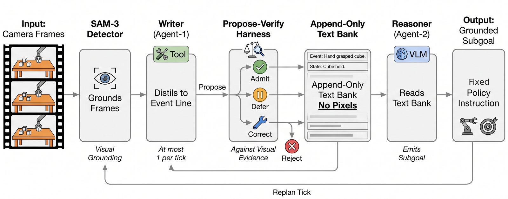

# GAMMA: Grounded Multi-Agent Memory with Mechanical Audit

Code for **GAMMA**, a two-agent grounded text memory system for memory-intensive
robot manipulation. A detector tool (SAM-3) grounds every frame; a VLM **writer**
distils each replan window into one grounded text line; an append-only **text
memory bank** is the only history carrier; a VLM **reasoner** reads the bank (no
pixels) and emits the next grounded subgoal for a fixed subgoal-conditioned
π0.5 policy. Every agent claim passes a **propose–verify harness** that admits,
defers, corrects or rejects it against mechanical visual evidence, at corpus
construction and at deployment alike.

On the sixteen RoboMME memory tasks GAMMA reaches 66.0 % success with the
policy held fixed (79 % of the privileged oracle ceiling, 84.1 %; 57.4 % with
0.8B agents), and it transfers with its contracts unchanged to RoboMemArena
(36.9 % task / 56.2 % subtask success with the full pipeline on held-out
layouts; 38.7 / 58.6 with the harness predicates alone). Trained weights are
released upon acceptance, see [CHECKPOINTS.md](CHECKPOINTS.md).

```
memory (frames) --> grounded symbolic subgoal --> action chunk
                    ^^^^^^^^^^^^^^^^^^^^^^^^
                    the only stage this repo learns; the policy is fixed
```

<p align="center">
  
</p>

## Results (RoboMME, 16 memory tasks, closed loop)

Success rate (%), mean over three serving seeds at 30 episodes per task, all with
the same fixed subgoal-conditioned π0.5 executor. Baseline and oracle rows are
the numbers reported by [RoboMME](https://github.com/RoboMME/robomme_policy_learning)
([paper](https://arxiv.org/abs/2603.04639), [benchmark](https://github.com/RoboMME/robomme_benchmark),
[models](https://huggingface.co/Yinpei/mme_vla_suite)); their checkpoints are on that model hub.

| configuration | memory | Avg | checkpoint |
|---|---|---:|---|
| π0.5 end-to-end | none | 17.9 | [RoboMME](https://github.com/RoboMME/robomme_policy_learning) |
| FrameSamp+Modul (best memory-VLA) | latent frame memory | 44.5 | [RoboMME](https://github.com/RoboMME/robomme_policy_learning) |
| MemER-style keyframe pipeline | VLM keyframe selection | 42.4 | [RoboMME](https://github.com/RoboMME/robomme_policy_learning) |
| GroundSG+QwenVL (single VLM) | raw frames | 32.7 | [RoboMME](https://github.com/RoboMME/robomme_policy_learning) |
| **GAMMA (ours)** | verified grounded text + harness | **66.0** | [GAMMA_checkpoints.zip](CHECKPOINTS.md), released upon acceptance |
| GAMMA (ours), 0.8B agents | same, Qwen3.5-0.8B agents | 57.4 | [GAMMA_checkpoints.zip](CHECKPOINTS.md) |
| GroundSG+Oracle (privileged ceiling) | oracle subgoals | 84.1 | [RoboMME](https://github.com/RoboMME/robomme_policy_learning) |

Harness ablation (one verdict disabled at a time): w/o DEFER 62.7, w/o REJECT 55.1,
w/o CORRECT 65.0; no harness 51.2 (9B) and 32.3 (0.8B, vs 57.4 with it).

### RoboMemArena (26 tasks, held-out layouts)

Task / subtask success (%), families as in the benchmark's Table 2. Baseline and
privileged rows are the numbers reported by [RoboMemArena](https://github.com/OpenHelix-Team/RoboMemArena)
under its own protocol; GAMMA and the privileged feed rows under our protocol are
measured on seeds 50–99 (disjoint from the demonstration seeds).

| row | Transferring | Occlusion | Counting | Sequence | Average |
|---|---|---|---|---|---|
| π0.5 (no subgoals), reported | 20.0 / 42.8 | 12.7 / 17.2 | 14.3 / 50.9 | 60.0 / 71.6 | 21.5 / 38.7 |
| MemER, reported | 20.0 / 36.1 | 16.4 / 33.2 | 27.1 / 65.1 | 65.0 / 79.1 | 27.3 / 49.1 |
| PrediMem (benchmark authors), reported | 22.5 / 45.2 | 27.3 / 38.4 | 45.7 / 69.3 | 72.5 / 89.5 | 38.5 / 55.2 |
| π0.5 executor, plan fed on benchmark stage predicates (privileged, ours) | 3.5 / 23.6 | 2.4 / 40.7 | 11.4 / 36.5 | 35.0 / 68.1 | 10.0 / 41.1 |
| **GAMMA (ours), full pipeline: writer + harness (10 ep.)** | 12.5 / 24.2 | 17.3 / 47.8 | 61.4 / 70.0 | 72.5 / 87.1 | **36.9 / 56.2** |
| GAMMA, harness predicates only, no writer (50 ep.) | 27.5 / 37.3 | 18.9 / 49.2 | 52.0 / 67.2 | 81.0 / 90.7 | 38.7 / 58.6 |
| ground-truth subtask feed (privileged), reported | 32.5 / 54.8 | 33.6 / 49.8 | 51.4 / 75.6 | 85.0 / 92.3 | 46.1 / 64.8 |

<details>
<summary>Per-task numbers</summary>

| | PickX | BinF | SwingX | StopC | VU | BU | VUS | BUS | PH | VRP | VPB | VPO | MC | IP | PL | RS | Avg |
|---|---|---|---|---|---|---|---|---|---|---|---|---|---|---|---|---|---|
| π0.5 e2e | 42.9 | 30.0 | 35.6 | 6.7 | 20.4 | 22.2 | 18.7 | 6.7 | 11.3 | 0.4 | 31.1 | 25.8 | 26.0 | 1.6 | 2.9 | 4.7 | 17.9 |
| FrameSamp+Modul | 87.3 | 39.6 | 92.0 | 42.0 | 32.7 | 25.1 | 24.4 | 18.2 | 22.9 | 30.4 | 60.0 | 32.0 | 77.8 | 7.6 | 53.6 | 66.7 | 44.5 |
| MemER | 79.3 | 56.7 | 59.3 | 0.0 | 81.3 | 72.0 | 38.0 | 21.3 | 70.7 | 25.3 | 30.0 | 26.0 | 82.7 | 6.7 | 16.7 | 12.0 | 42.4 |
| GroundSG+QwenVL | 92.7 | 52.0 | 7.3 | 0.0 | 88.7 | 24.0 | 30.7 | 14.0 | 15.1 | 25.3 | 54.0 | 31.8 | 71.6 | 3.3 | 6.7 | 6.0 | 32.7 |
| **GAMMA** | 98.9 | 71.1 | 68.9 | 35.5 | 86.7 | 84.4 | 75.6 | 35.6 | 71.1 | 65.6 | 75.5 | 66.7 | 62.2 | 3.3 | 98.9 | 56.7 | **66.0** |
| GroundSG+Oracle | 100.0 | 85.8 | 100.0 | 49.7 | 98.8 | 95.0 | 99.2 | 80.2 | 83.3 | 97.3 | 100.0 | 100.0 | 87.8 | 15.6 | 97.0 | 55.6 | 84.1 |

Task keys: PickX PickXtimes, BinF BinFill, SwingX SwingXtimes, StopC StopCube,
VU VideoUnmask, BU ButtonUnmask, VUS VideoUnmaskSwap, BUS ButtonUnmaskSwap,
PH PickHighlight, VRP VideoRepick, VPB VideoPlaceButton, VPO VideoPlaceOrder,
MC MoveCube, IP InsertPeg, PL PatternLock, RS RouteStick.
</details>

## Repository layout

| directory | contents |
|---|---|
| `corpus/` | corpus generation: SAM-3 detection cache, the evidence-gated target generator for both agents, ms-swift dataset conversion, corpus verification gates, writer rollout that produces the reasoner's training banks |
| `train/` | ms-swift LoRA fine-tuning scripts for writer and reasoner, open-loop reasoner evaluation, and the end-to-end chain used for the paper's checkpoints |
| `serve/` | the agent server (writer + reasoner + harness) and the deterministic evidence readers it calls |
| `eval/` | closed-loop evaluation on RoboMME: the subgoal-predictor client, lane launchers, the diagnostic runs of the single-VLM baselines, and our patches to the benchmark's policy-learning repo |
| `analysis/` | trace aggregation, tick-level diagnosis, failure annotation videos |
| `figures/` | scripts that render the paper's figures from logged traces |
| `rma/` | the RoboMemArena port: frame extraction, camera calibration, the RMA corpus generator and writer SFT, the RMA agent server (harness with proprioceptive predicates), SAM-3 prompt tuning, the evaluation stack (oracle feeds, GAMMA closed loop, lane launchers with crash resume) and the policy configs |
| `docs/` | design documents for the RMA port |

All machine-specific locations are read from environment variables. Copy
`env.sh.example` to `env.sh`, edit the paths, and `source env.sh` before running
anything.

## Environments

Three Python environments are used, mirroring the development setup:

1. **Agents / detector / server** (`MSSWIFT_PY`): Python ≥ 3.10 with
   `torch`, `transformers` (a version with `Qwen3.5` and `Sam3Model`), `peft`,
   `ms-swift` (training), `accelerate`, `deepspeed`, `pillow`, `numpy`.
   Everything under `corpus/sam3_precompute.py`, `corpus/rollout_agent1.py`,
   `train/` and `serve/` runs here.
2. **RoboMME evaluation client** (`CLIENT_PY`): the benchmark's own
   `openpi_robocasa` client environment (RoboMME simulator + openpi websocket
   client). `eval/eval_wam_closedloop.py` runs here.
3. **Plain analysis** (`GAMMA_PY`): `numpy`, `opencv-python`, `matplotlib`,
   `pyarrow`, `pillow`. Corpus generation (`corpus/gen_wam_sft_v12.py`),
   `analysis/` and `figures/` run here. `ffmpeg` is needed by
   `analysis/annotate_failed_eps.py`.

The RoboMemArena stack has its own environment; see
`rma/eval_stack/EVAL_STACK_SETUP.md`.

## Benchmark setup (RoboMME)

1. Clone the [RoboMME policy-learning repository](https://github.com/RoboMME/robomme_policy_learning) and point `ROBOMME_ROOT` at it.
   Train (or obtain) the subgoal-conditioned π0.5 executor with their
   `GroundSG` recipe; the checkpoint we used is in the checkpoint archive
   (`policy/pi05_subgoal_conditioned_79999`) and is expected at
   `${ROBOMME_ROOT}/runs/ckpts/mme_vla_suite/symbolic_grounded_repro/79999`
   (or edit `--policy.dir` in the lane scripts).
2. Apply our patches to that repo:
   ```
   cd ${ROBOMME_ROOT}
   git apply ${GAMMA_ROOT}/eval/benchmark_patches/robomme_eval_and_serve.patch
   cp ${GAMMA_ROOT}/eval/wam_subgoal_predictor.py examples/robomme/
   ```
   The only parts of that patch GAMMA needs are the `max_episodes` argument in
   `examples/robomme/eval.py`, the tolerant Gemini import in
   `subgoal_predictor.py`, and the serve-side changes in `scripts/serve_policy.py`;
   the event-bank fields in the same patch belong to unrelated experiments and
   are inert by default. `robomme_qwenvl_memer_diag.patch` adds the
   `WAM_DIAG_TRACE=1` logging used for the tick-level diagnosis of the
   GroundSG+QwenVL and MemER baselines (Appendix, `eval/eval_qwenvl_diag.sh`,
   `eval/eval_memer_diag.sh`). `policy_training_config.patch` is the full diff
   of the policy-training code and is only needed for the RMA policy
   (config `rma_ground_sg`), see below.
3. Export the benchmark's recorded episodes in LeRobot parquet format to
   `${GAMMA_DATA}/data/robomme_lerobot` (the layout `corpus/gen_wam_sft_v12.py`
   reads: per-episode parquet with `observation.images.*`, the oracle subgoal
   columns and the online subgoal column).

## Pipeline

The eight stages from raw episodes to the paper's tables, and where each lives:

| stage | what | entry point |
|---|---|---|
| 1 | detection cache (SAM-3 on the writer's frame grid) | `corpus/sam3_precompute.py` |
| 2 | verified writer / reasoner targets + corpus audits | `corpus/gen_wam_sft_v12.py`, `corpus/audit_derivable.py`, `corpus/verify_alignment.py` |
| 3 | writer (Agent-1) LoRA finetuning | `train/train_agent1.sh` (0.8B: `train/train_agent1_0p8b.sh`) |
| 4 | writer rollout → reasoner corpus | `corpus/rollout_agent1.py`, `corpus/snap_agent2_targets.py` |
| 5 | reasoner (Agent-2) finetuning + open-loop check | `train/train_agent2.sh`, `train/eval_agent2.py` |
| 6 | serving: agent server with the propose–verify harness | `serve/wam_agent_server.py` |
| 7 | closed-loop evaluation lanes (seeds 7, 8, 9; 30 episodes/task) | `eval/eval_lane_9b.sh`, `eval/eval_lane_0p8b.sh`, `eval/eval_wam_parallel.sh` |
| 8 | analysis, tick-level diagnosis, figures and paper tables | `analysis/`, `figures/`, `analysis/update_0p8b_paper.py`, `analysis/make_rma_tables.py` |


The end-to-end sequence used for the paper's checkpoints is
`train/pipeline_chain_v17.sh`; the steps are described below so they can be run
by hand. `V` below is the corpus directory, e.g. `${GAMMA_DATA}/data/wam_sft_v17`.

### 1. Detection cache

SAM-3 (`facebook/sam3`) is run on every frame of the writer's grid (stride 4)
with the phrase-tuned per-class prompts in `corpus/sam3_prompts.json`; the
identical detector, prompts and post-processing are used at deployment.

```
OUT_DIR=$V THR=0.35 CUDA_VISIBLE_DEVICES=0 $MSSWIFT_PY corpus/sam3_precompute.py
```
Workers self-balance through lock files, so the same command can be started on
several GPUs. Output: `$V/dets_sam3/e<episode>.json`.

### 2. Targets for both agents

```
OUT_DIR=$V DET_DIR=$V/dets_sam3 $GAMMA_PY corpus/gen_wam_sft_v12.py
```
writes `agent1_{train,val}.jsonl` (writer records: instruction, phase, last 8
bank lines, 5 window frames with per-frame detections, the planner's expected
next subgoal, and the target event line or `NONE`) and `agent2_{train,val}.jsonl`
(reasoner records: instruction, full bank, target subgoal). The generator
implements the paper's three train-time contracts: event lines from verified
trackers (covering events, container-move chains, highlight appearances,
per-stroke demo records), evidence gates (a line only at the window that shows
its evidence), and knowability (coordinates the writer cannot see are demoted).
Validation is `episode_index % 10 == 0`. Knobs: `EVENT_ALIGN`, `SNAP_DEMO`,
`OVER_*` (all default to the paper settings), `ONLY_FILES`, `LIMIT`, `VAL_ONLY`.

Verification gates run before any training:
```
SPLIT=val $GAMMA_PY corpus/audit_derivable.py $V     # every target coordinate is findable in the writer's inputs
$GAMMA_PY corpus/verify_alignment.py $V              # evidence gates: completed/move/appeared lines land on the window showing them
$GAMMA_PY corpus/bank_quality_stats_v17.py $V        # bank statistics reported in the paper
$GAMMA_PY corpus/make_v17_task_videos.py             # one annotated target video per task for review
```

### 3. Writer (Agent-1) training

```
SRC=$V $GAMMA_PY corpus/make_agent1_swift.py         # -> agent1_swift_{train,val}.jsonl (ms-swift multimodal format)
bash train/train_agent1.sh                           # ms-swift LoRA on Qwen/Qwen3.5-9B, 1 epoch, 4 GPUs
```
The prompt built by `make_agent1_swift.py` is byte-identical to what
`rollout_agent1.py` and the server build at inference time (train/serve
contract). LoRA rank 16, α 32, lr 1e-4, effective batch 64, max length 3200.
Copy the last checkpoint to `${GAMMA_DATA}/runs/agent1_v17_final`.

### 4. Writer rollout → reasoner corpus

The reasoner is trained on banks the trained writer actually produces, not on
ground-truth banks:
```
for i in 0 1 2 3; do
  CUDA_VISIBLE_DEVICES=$i CKPT=${GAMMA_DATA}/runs/agent1_v17_final SPLIT=train SHARD=$i NSHARD=4 BATCH=24 \
    DATA_DIR=$V FRAMES_DIR=$V $MSSWIFT_PY corpus/rollout_agent1.py &
done; wait
cat $V/agent2_pred_train.s{0,1,2,3}.jsonl > $V/agent2_pred_train.jsonl
CKPT=${GAMMA_DATA}/runs/agent1_v17_final SPLIT=val BATCH=24 DATA_DIR=$V FRAMES_DIR=$V $MSSWIFT_PY corpus/rollout_agent1.py
$GAMMA_PY corpus/snap_agent2_targets.py $V           # reasoner targets: oracle string with coordinates snapped to the predicted bank
SRC=$V BANKSRC=pred TAG=pred $GAMMA_PY corpus/make_agent2_swift.py
```

### 5. Reasoner (Agent-2) training and open-loop check

```
bash train/train_agent2.sh                           # LoRA on Qwen/Qwen3.5-9B, bank-only input, max length 2600
CKPT=${GAMMA_DATA}/runs/agent2_v17_final VALFILE=$V/agent2_pred_val.jsonl DATA_DIR=$V \
  WAM_BASE=Qwen/Qwen3.5-9B $MSSWIFT_PY train/eval_agent2.py        # exact-match subgoal accuracy on held-out banks
```
`WAM_A2_IMG=1` in `make_agent2_swift.py` and the server restores the earlier
variant that also shows the reasoner the current frame; the paper's reasoner is
bank-only (the frame measurably does not help).

For the 0.8B arm, set `WAM_BASE=Qwen/Qwen3.5-0.8B` and `--model Qwen/Qwen3.5-0.8B`
in the two training scripts; everything else is unchanged.

### 6. Serving: the agent server and the harness

`serve/wam_agent_server.py` loads the base VLM with both LoRA adapters and
exposes three HTTP endpoints used by the evaluation client:

* `POST /reset` — instruction, task and the demonstration prefix; replays the
  prefix through the writer in 16-step windows to build the demo record
  (deterministic readers own the RouteStick / PatternLock / VideoPlaceButton
  demo claims, see `serve/rs_dir_algo.py`, `serve/vpb_reader.py`).
* `POST /tick` — the five window frames of one 16-step action chunk; runs SAM-3,
  the writer, the harness verdicts and the reasoner; returns the subgoal.
* `POST /episode_end`.

Environment variables:

| variable | meaning |
|---|---|
| `WAM_BASE` | base model id (`Qwen/Qwen3.5-9B` or `Qwen/Qwen3.5-0.8B`) |
| `A1_CKPT`, `A2_CKPT` | writer / reasoner LoRA directories |
| `PORT` | HTTP port (default 8899) |
| `WAM_TRACE` | per-tick JSONL trace: detections, writer line, bank, reasoner output, live oracle (the substrate of every analysis script) |
| `WAM_HARNESS_OFF=1` | disable all serve-time propose–verify machinery (the "no harness" arm) |
| `WAM_V19_GATES=1` | enable the full-coverage claim gates (pick/place/press deferral, citation guards); the paper's main configuration |
| `WAM_NO_CORRECT=1` | disable the CORRECT verdict (grounding rebinding) — the "w/o CORRECT" ablation |
| `WAM_A2_IMG=1` | frame-in-context reasoner variant |
| `WAM_SWING_AUTO`, `WAM_BINFILL_DISCIPLINE` | retired per-task gates, off by default (kept for the record; both measured harmful) |

The harness itself is documented inline in the server: each verdict names the
evidence it is anchored on (detection presence/absence at a location,
occlusion of a known object, arrival within a radius, displacement above a
threshold) and the measurement that motivated it.

> The "w/o DEFER" and "w/o REJECT" rows of the ablation table were produced with
> per-verdict switches on a collaborator's serving host; those two switches are
> not yet merged into this file. `WAM_NO_CORRECT` and `WAM_HARNESS_OFF` are.

### 7. Closed-loop evaluation on RoboMME

One lane = one GPU running the policy server, the agent server and the
simulator client for a list of tasks:
```
bash eval/eval_lane_9b.sh <GPU> on 30 7 laneW        # ARM=on|off, 30 episodes/task, serving seed 7
TASKS_OVERRIDE=BinFill,PickXtimes bash eval/eval_lane_9b.sh 5 on 30 7 laneW
bash eval/eval_wam_parallel.sh 79999 30 <run_name> <A1_CKPT> <A2_CKPT>   # two lanes, eight tasks each
```
Lane lists (W/X/Y/Z, A/B) are defined at the top of the lane scripts. Results
land in the benchmark's `runs/evaluation/<run_name>/ckpt<step>/seed<seed>/oracle/`
as `progress.json` (task → episode → success) plus one annotated video and
metrics file per episode. Aggregate with
```
$GAMMA_PY analysis/agg_progress.py "wam_9b_on_lane*"
```
The paper's numbers are the mean over serving seeds 7, 8, 9 at 30 episodes per task.

The client (`eval/eval_wam_closedloop.py`) wraps the benchmark's `eval.py` and
replaces its oracle subgoal predictor with `eval/wam_subgoal_predictor.py`,
which talks to the agent server; the benchmark's scoring loop is untouched.

### 8. Analysis and figures

* `analysis/annotate_failed_eps.py --arm <run> --lanes W,X,Y,Z --out DIR` renders one
  video per failed episode with detections, our and the oracle's cited
  coordinates, writer line and bank overlaid, plus an `index.md` giving the first
  tick where our subgoal diverged from the oracle.
* `analysis/analyze_tick_diag.py` builds the tick-level diagnosis table and
  figure from the baseline traces written with `WAM_DIAG_TRACE=1`.
* `analysis/paired_diag.py`, `analysis/failclass.py`, `analysis/stall_mech.py`:
  paired harness-on/off comparison, failure classification and stall
  attribution over the serve traces.
* `figures/make_harness_rs.py`, `figures/make_harness_more.py`: the harness case
  figures; `figures/make_teaser.py`, `figures/patch_compare.py`: the teaser.

## RoboMemArena port (`rma/`)

Nothing in GAMMA binds to RoboMME: the contracts assume a detector, a tick grid,
recorded episodes and an evidence stream to verify claims against. The port
changed two geometry constants (tick 10 steps, 3 frames per window), the detector
prompts, and the harness's evidence predicates, which on this benchmark read the
executor's proprioceptive state (`rma/rma_progress_predicates.py`: pick = fingers
stalled inside the object's grasp band then the hand rises 3 cm; place = carry then
release; pour = wrist rotated ≥ 25° from the carry orientation and back; open /
close = handle grasp and stroke). Grasp bands come from the recorded episodes
(`rma/grasp_widths.py` → `rma/grasp_widths.json`); on the recordings the predicates
fire inside their own segment in 879 of 888 cases (`rma/predicate_audit.json`).

Steps (all under `source env.sh`; the benchmark repo is expected at
`RMA_BENCH_ROOT`, the released demonstrations at `RMA_DATA_ROOT`):

1. **Executor.** Build the policy dataset and train the benchmark authors' π0.5
   recipe with the subtask text as prompt (config `rma_pi05_sgprompt` in
   `eval/benchmark_patches/policy_training_config.patch`; launcher
   `rma/policy/launch_gate_train.sh` with `STEPS=40000 ACCUM_UP=2 FSDP=4`):
   `$GAMMA_PY rma/policy/build_rma_dataset.py`, then
   `STEPS=40000 ACCUM_UP=2 FSDP=4 bash rma/policy/launch_gate_train.sh rma_pi05_sgprompt rma_pi05_sgprompt_v1 4,5,6,7`.
   The final checkpoint id is 79999. `rma/download_released_pi05.py` fetches the
   authors' released checkpoint (config `rma_pi05_theirs`) for the same-protocol rows.
2. **Frames and detections.** `rma/extract_rma_frames.py` reconstructs episodes
   onto the writer's grid; `PROMPTS=rma/prompts_rma.json $MSSWIFT_PY rma/sam3_precompute_rma.py`
   caches SAM-3 detections (prompt tuning: `rma/tune_prompts_rma.py`).
3. **Corpus and writer.** `OUT=$F $GAMMA_PY rma/build_rma_corpus.py` (tick 10, three
   frames per window, a proprioceptive state readout per frame, NONE ratio 3, seeds
   100–131 train / 132–139 validation), `SRC=$F $GAMMA_PY rma/make_agent1_swift_rma.py`,
   `bash rma/train_agent1_rma.sh <gpu>` (LoRA r16, one epoch). `rma/chain_rma_corpus_sft.sh`
   chains the three. `rma/seg_boundary_states.py` reproduces the segment-boundary
   measurements of the paper's appendix (hand-off timing).
4. **Serving.** `rma/rma_agent_server.py` is the RMA agent server: `/reset` takes the
   instruction and the fixed per-task plan (`rma/eval_stack/rma_oracle_plans.json`),
   `/tick` takes three frames with their states and returns the current subtask after
   the harness. Switches: `A1_CKPT`/`WAM_BASE` with `WAM_SETTLE_TICKS=2` (the paper's
   reported configuration: the writer runs and its verified claims are admitted once
   the predicate has held two ticks), `WAM_A1_OFF=1` (harness-only ablation: progress
   claims raised by the predicates and admitted after `AUTO_GRACE=2` ticks), `WAM_HARNESS_OFF=1`,
   `WAM_SAM_OFF=1`, `WAM_VERIFY_VISION`, `REFUTE_TICKS`, `DET_THR`, `WAM_TRACE`.
5. **Closed-loop evaluation** (`rma/eval_stack/`, protocol: seeds 50–99, 50
   episodes per task, 10 actions per policy call, 2,500 steps):
   * `run_rma_eval.sh <cfg> <exp> <ckpt> <server_gpu> <client_gpu>` starts the policy
     server and the benchmark client; `RMA_ORACLE=1` feeds the plan on the benchmark's
     own stage predicates (`rma_oracle_subgoal.py`; `RMA_ORACLE_GATE=1|2` adds the
     segment-completion gates), `RMA_GAMMA=1 RMA_AGENT_PORT=<port>` runs GAMMA
     (`run_rma_gamma_eval.py`, `rma_gamma_provider.py`), `RMA_PROMPT_FROM_SUBGOAL=1`
     sends the subtask text as the policy prompt (the authors' protocol),
     `RMA_PLAN_LABELS=rma_their_labels.json` emits the authors' primitive labels
     (needed with their released checkpoint), `RMA_DIAG_TRAIN_SEEDS=100` is the
     labelled diagnostic on the authors' default (training-layout) seeds.
   * `chain_rma_gamma_probe.sh <ckpt> <L1|L2|L2c> [trials] [tag]` runs one GAMMA lane
     (own agent server + policy server + client; `CFG_OVERRIDE`/`CKPT_OVERRIDE`
     for the released checkpoint); `launch_gamma_final50h.sh` is the six-lane
     50-episode run behind the paper's GAMMA row, `chain_rma_oracle_final6.sh` the
     stage-predicate feed row, `launch_theirs50u.sh` the released-checkpoint row.
   * `rma_lane_retry.sh` wraps a lane and resumes from the first missing task after
     a client crash (the benchmark's EGL renderer aborts intermittently).
6. **Tables.** `analysis/make_rma_tables.py` regenerates the paper's RoboMemArena
   section and both tables from the lane outputs; `analysis/apply_rma_section.py`
   applies them to the manuscript.

`docs/RMA_SPEC_AND_PLAN.md`, `docs/RMA_TASK_DOSSIER.md` and
`docs/RMA_GROUNDED_COORD_REPORT.md` are the working documents of the port; the
grounded-subgoal executor variants they describe (`rma_ground_sg`) are earlier
arms and are not the paper's configuration.

## Citation

Paper under review (ICLR 2027 submission). A citation entry will be added on
acceptance.

## License

MIT, see [LICENSE](LICENSE). The RoboMME and RoboMemArena benchmarks, openpi,
ms-swift, Qwen and SAM-3 are governed by their own licenses.
